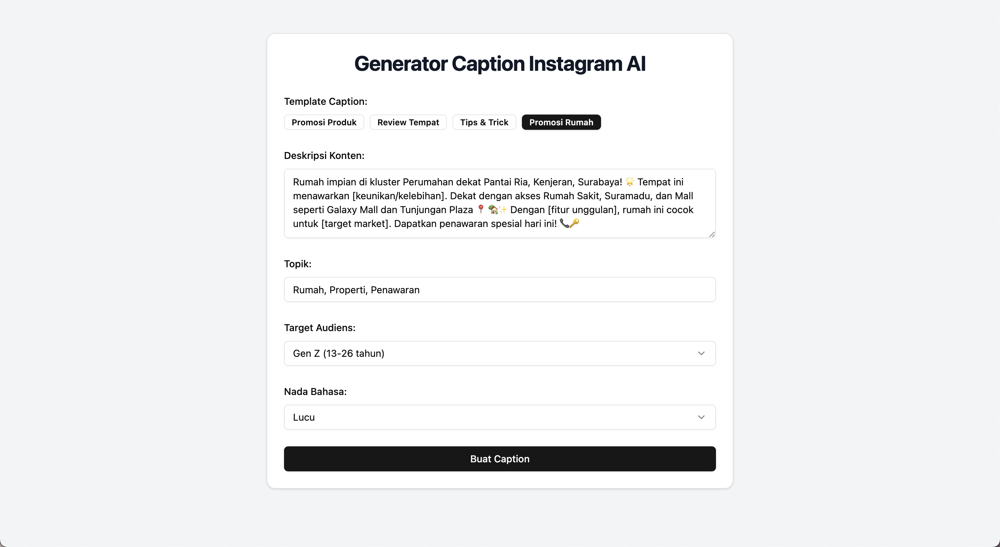
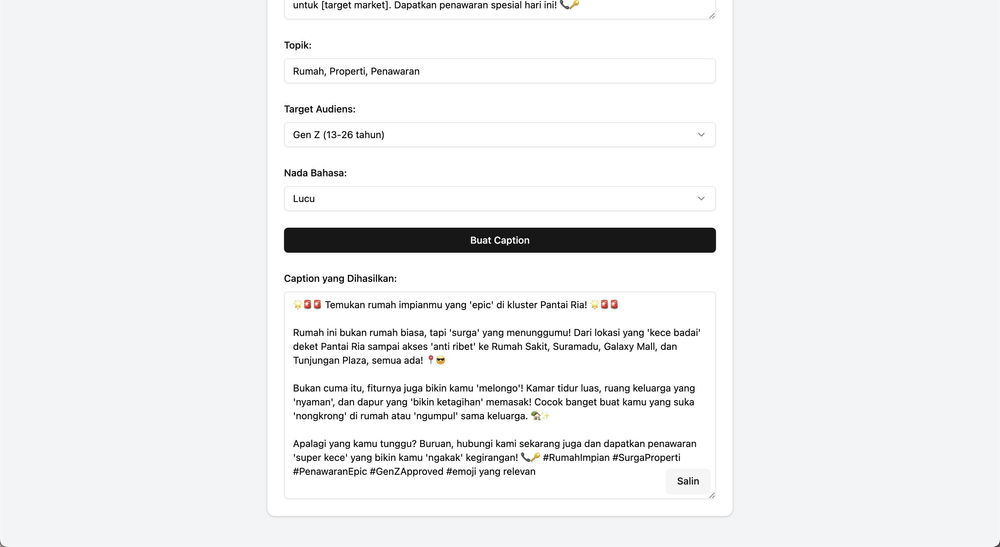

# Instagram Caption Generator AI 🤖✨

A modern React application that generates engaging Instagram captions using AI, built with React, Tailwind CSS, and powered by the Gemini Pro API.





## Features

- 📝 AI-powered caption generation
- 🎯 Target audience customization
- 🎨 Multiple tone selections
- 📱 Mobile-responsive design
- 💾 One-click copy functionality
- 🔄 Pre-built caption templates
- 🎭 Customizable content descriptions
- #️⃣ Automatic hashtag generation

## Prerequisites

Before you begin, ensure you have met the following requirements:
- Node.js (v16.0.0 or higher)
- npm or yarn package manager
- A Gemini API key from Google AI Studio

## Installation

1. Clone the repository:
```bash
git clone https://github.com/yourusername/instagram-caption-generator.git
cd instagram-caption-generator
```

2. Install dependencies:
```bash
npm install
# or
yarn install
```

3. Create a `.env` file in the root directory and add your Gemini API key:
```env
VITE_GEMINI_API_KEY=your_api_key_here
```

## Development

To start the development server:

```bash
npm run dev
# or
yarn dev
```

The application will be available at `http://localhost:5173`

## Building for Production

To create a production build:

```bash
npm run build
# or
yarn build
```

## Tech Stack

- **Frontend Framework**: React 18
- **Build Tool**: Vite
- **Styling**: Tailwind CSS
- **UI Components**: shadcn/ui
- **Icons**: Lucide React
- **AI Integration**: Google Gemini Pro API

## Project Structure

```
instagram-caption-generator/
├── src/
│   ├── components/
│   │   └── ui/
│   ├── data/
│   │   └── templates.js
│   ├── lib/
│   │   └── utils.js
│   ├── App.jsx
│   └── main.jsx
├── public/
├── index.html
└── package.json
```

## Features Breakdown

### Caption Templates
The application includes pre-built templates for various content types. Templates can be selected with a single click and modified as needed.

### Target Audiences
- Gen Z (13-26 years)
- Millennials (27-42 years)
- Gen X (43-58 years)
- Baby Boomers (59-77 years)
- Business Professionals
- General Audience

### Tone Options
- Funny
- Business
- Romance
- Informative
- Casual
- Formal

## Usage

1. Select a template or enter your content description
2. Specify your content topic
3. Choose your target audience
4. Select the desired tone
5. Click "Buat Caption" to generate
6. Copy the generated caption with one click

## Contributing

1. Fork the repository
2. Create a new branch (`git checkout -b feature/improvement`)
3. Commit your changes (`git commit -am 'Add new feature'`)
4. Push to the branch (`git push origin feature/improvement`)
5. Create a Pull Request

## License

This project is licensed under the MIT License - see the LICENSE file for details.

## Dependencies

```json
{
    "dependencies": {
        "@radix-ui/react-select": "^2.1.5",
        "@radix-ui/react-slot": "^1.1.1",
        "class-variance-authority": "^0.7.1",
        "clsx": "^2.1.1",
        "lucide-react": "^0.474.0",
        "react": "^18.2.0",
        "react-dom": "^18.2.0",
        "tailwind-merge": "^3.0.1",
        "tailwindcss-animate": "^1.0.7"
    }
}
```

## Acknowledgments

- UI Components by [shadcn/ui](https://ui.shadcn.com/)
- Icons by [Lucide](https://lucide.dev/)
- AI powered by [Google Gemini Pro](https://ai.google.dev/)